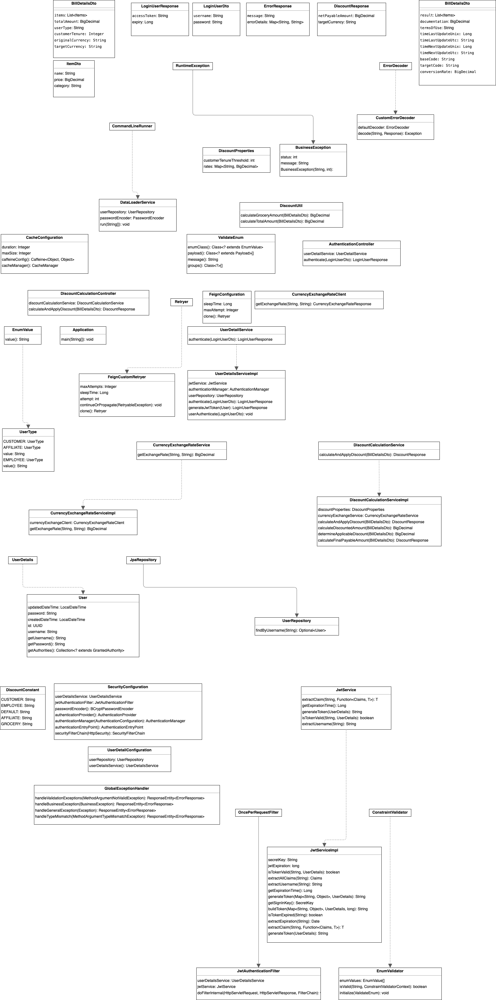

# Currency Exchange and Discount Calculation Application
This is a Spring Boot application that integrates with a third-party currency exchange API to retrieve real-time exchange rates. It calculates the total payable amount for a bill in a specified currency after applying applicable discounts.

# Features
###  Discount Calculation:
  - Employees get a **30%** discount
  - Affiliates get a **10%** discount
  - Customers with over **2** years of tenure get a **5%** discount
  - For every **100** on the bill, there is **5%** discount
  - Percentage-based discounts do not apply to groceries
### Currency Conversion:
  - Converts the bill total from the original currency to the target currency using real-time exchange rates
### JWT Authentication:
  - Secures endpoints using JWT authentication
### In-Memory H2 Database:
  - Stores user credentials for authentication.

# Prerequisites
 - Java 21
 - Gradle
 - Docker | Podman (Optional)

# Getting Started
### Clone the Repository
  ```
git clone https://github.com/shahid-hussain-sw/ms-discount-service.git
cd ms-discount-service

```
### Build the Project
```
./gradlew clean build
```
### Run the Application
```
./gradlew bootRun
``` 
  - The application will start at http://localhost:8080

### Running Tests
#### Run Unit Tests
```
./gradlew test

```
#### Generate Code Coverage Reports
```
./gradlew jacocoTestReport

```
  - The report will be generated at build/reports/jacoco/test/html/index.html.

### Static Code Analysis (Linting)
#### Apply Linting
```
./gradlew spotlessApply
```

# Endpoints
  ###  Authenticate
   - URL: POST /authenticate
   - Description: Generates a JWT token for authentication
   - Request
```
curl --request POST \
  --url http://localhost:8080/api/login \
  --header 'Content-Type: application/json' \
  --data '{
	"username": "admin",
	"password": "admin"
}'
```
   - Response
```json
"eyJhbGciOiJIUzI1NiJ9..."
```
### Calculate Discount
   - URL: POST /api/calculate
   - Description: Calculates the final payable amount after applying discounts and currency conversion
   - Request
```
curl --request POST \
  --url http://localhost:8080/api/calculate \
  --header 'Authorization: Bearer <token> \
  --header 'Content-Type: application/json' \
  --data '{
  "items": [
    {
      "name": "Item1",
      "category": "ELECTRONICS",
      "price": 200.00
    },
    {
      "name": "Item2",
      "category": "GROCERIES",
      "price": 50.00
    }
  ],
  "totalAmount": 250.00,
  "userType": "EMPLOYEE",
  "customerTenure": 3,
  "originalCurrency": "USD",
  "targetCurrency": "EUR"
}'
```
   - Response
```json
{
     "netPayableAmount": 156.83,
     "targetCurrency": "EUR"
}
```
# Caching
  - The application uses Spring's caching mechanism to cache exchange rates. The cache is configured to expire after 10 minutes

# Integrated Third-Party API
   - The application integrates with the following third-party API for real-time exchange rates:
   - Open Exchange Rates API
       - Endpoint: https://v6.exchangerate-api.com/v6/{your_api_key}/pair/{base_currency}/{target_currency}
       - Documentation https://www.exchangerate-api.com/docs/pair-conversion-requests

### API Collection
You can download the API collection from [here](resources/collection/discount.json).
# UML Diagram
  - 
